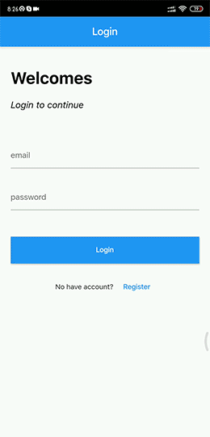
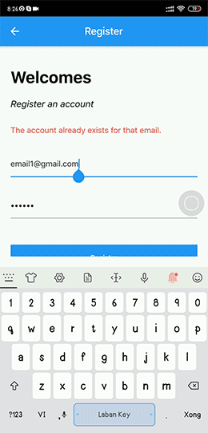

Login Firebase App

## Important ingredients 
- [State Management BloC](https://bloclibrary.dev/#/)
- [Firebase](https://firebase.flutter.dev/)

## Plugin 

- [BloC](https://plugins.jetbrains.com/plugin/12129-bloc)

## Rule

- Separation of business logic with Ui
- Ui will be updated through BloC

## Screenshots

